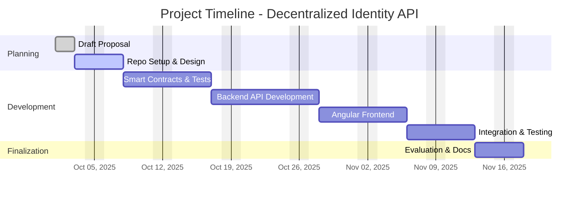

# **Project Proposal: A Blockchain-Based Decentralized Identity and Profile Management API (Self-Sovereign Identity)**

## **Abstract**

Centralized identity systems expose users to privacy breaches, credential theft, and data silos across platforms. This project proposes building a **Decentralized Identity and Profile Management API** based on **Self-Sovereign Identity (SSI)** principles using blockchain and IPFS. The system will allow users to create, manage, and verify digital identities through **decentralized identifiers (DIDs)** and **verifiable credentials (VCs)** while preserving user control and privacy.  

The project integrates:

- **ERC-725/735 smart contracts** for decentralized identity storage on Ethereum/Polygon.
- **Express.js backend API** for DID management and credential issuance.
- **IPFS** for decentralized document and metadata storage.
- **Angular frontend** for user-friendly credential visualization and management.

Expected outcomes include a fully functional prototype, API documentation, and performance comparison of on-chain vs. off-chain identity operations.

---

## **1. Introduction**

### **Problem Statement**

Modern web applications rely on centralized identity providers (Google, Facebook, etc.), resulting in data fragmentation, privacy risks, and dependence on third-party trust. Users lack ownership over their personal information and credentials.  

A **self-sovereign identity (SSI)** model enables individuals to own and control their digital identities using decentralized networks and verifiable credentials, ensuring interoperability and privacy across platforms.

### **Motivation**

Blockchain and decentralized storage technologies such as **Ethereum** and **IPFS** offer immutable, verifiable, and interoperable mechanisms for identity management. This project explores implementing **SSI-compliant identity APIs** that align with **W3C DID** standards and **ERC-725 (Identity standard)** for decentralized applications, educational institutions, and web service integrations.

---

## **2. Objectives**

1. **Develop ERC-725/735-compatible smart contracts** for decentralized identity management.  
2. **Implement an Express.js backend API** for creating, reading, updating, and verifying decentralized profiles.  
3. **Integrate IPFS** for secure, decentralized credential and metadata storage.  
4. **Develop an Angular frontend** for users to manage identities, credentials, and access rights.  
5. **Evaluate** the system’s performance, scalability, and interoperability using Ethereum and Polygon Amoy testnets.

---

## **3. Scope**

**In Scope:**

- ERC-725/735 identity smart contracts.
- RESTful DID and VC API with JWT + signature verification.
- Angular frontend for visualizing decentralized profiles.
- IPFS integration for credential storage.
- Deployment to Ethereum (Sepolia) and Polygon (Amoy) testnets.

**Out of Scope:**

- Mainnet deployment.
- Advanced ZK-based privacy protocols (e.g., zkSNARKs, Semaphore proofs).
- Mobile wallet integrations.

---

## **4. Literature Review and Critique**

### **1. Reidenberg, J. R. et al. (2021). "Privacy and Trust in Decentralized Identity Systems." IEEE Access.**

- **Summary:** Explores decentralized identity models emphasizing privacy trade-offs and interoperability.
- **Shortcoming:** Lacks practical implementation on multi-chain ecosystems or IPFS-based off-chain storage.
- **Resolution:** This project bridges that gap by implementing ERC-725 identities and IPFS integration.

### **2. Sporny, M., Longley, D., & Chadwick, D. (2020). "Verifiable Credentials Data Model 1.0." W3C Recommendation.**

- **Summary:** Defines standard data structures for verifiable credentials.
- **Shortcoming:** Does not detail implementation challenges for blockchain-based storage or verification.
- **Resolution:** The backend API will encode and verify VCs following this model using on-chain registries.

### **3. Lüders, B., & Schanzenbach, M. (2022). "Sovrin and the Evolution of Self-Sovereign Identity."**

- **Summary:** Analyzes the SSI ecosystem through Sovrin’s Hyperledger Indy implementation.
- **Shortcoming:** Limited to permissioned ledgers, lacks ERC-standard compliance for open web integration.
- **Resolution:** This project adopts ERC-725/735, enabling open interoperability across Ethereum-compatible networks.

### **4. Belchior, R. et al. (2021). "A Survey on Blockchain-Based Self-Sovereign Identity." IEEE Access.**

- **Summary:** Comprehensive analysis of SSI implementations and open challenges (usability, revocation).
- **Shortcoming:** Highlights lack of robust API and frontend ecosystems for SSI adoption.
- **Resolution:** This project builds a developer-ready REST API and UI for SSI usability and adoption.

### **5. Lundkvist, C. et al. (2018). "ERC-725: Proxy Identity for Ethereum." Ethereum Improvement Proposal.**

- **Summary:** Defines a smart contract identity model using key management and claims.
- **Shortcoming:** The EIP is abstract; lacks tested implementations for decentralized profiles.
- **Resolution:** This project implements a functional ERC-725-like `IdentityRegistry.sol` with live API endpoints.

---

## **5. Methodology**

### **Backend**

- **Framework:** Node.js with Express.js  
- **Modules:** `ethers.js`, `ipfs-http-client`, `jsonwebtoken`  
- **Purpose:** Provides REST endpoints for creating DIDs, issuing credentials, and verifying claims.

### **Smart Contracts**

- **Language:** Solidity (v0.8.20)
- **Tools:** Hardhat, OpenZeppelin
- **Contracts:** `IdentityRegistry.sol` — manages ERC-725 identity ownership and claim verification.

### **Frontend**

- **Framework:** Angular 17  
- **UI Library:** Angular Material  
- **Function:** DID registration, credential visualization, and verification dashboard.

### **Storage**

- **IPFS (via Pinata or Infura)** for decentralized credential documents.

### **Deployment**

- **Networks:** Ethereum Sepolia & Polygon Amoy testnets  
- **RPC Providers:** Infura or Alchemy  
- **Wallet Integration:** MetaMask for signing identity operations.

---

## **6. Expected Outcomes**

- ✅ A fully functional **Decentralized Identity & Profile Management API**  
- ✅ ERC-725-compliant **smart contracts** for verifiable identity  
- ✅ **Angular dashboard** for decentralized identity visualization  
- ✅ **Performance report** comparing Ethereum vs. Polygon testnets  
- ✅ **Documentation and GitHub repository** for public reference

---

## **7. System Architecture and Project Structure**

The project follows a modular **monorepo structure**, ensuring clean separation of concerns and CI/CD integration.

```plaintext
decentralized-identity-api/
├─ backend/
│  ├─ src/
│  │  ├─ controllers/ (DID, profile, VC handlers)
│  │  ├─ routes/ (API endpoints)
│  │  ├─ utils/ (crypto, IPFS helpers)
│  │  └─ index.js (server entry)
│  ├─ package.json
│  └─ README-backend.md
├─ frontend/
│  ├─ angular-src/ (Angular app)
│  └─ README-frontend.md
├─ contracts/
│  └─ IdentityRegistry.sol (ERC-725 like)
├─ scripts/
│  └─ deploy.js
├─ test/
│  └─ api.test.js
├─ hardhat.config.js
├─ package.json (root for monorepo scripts)
├─ README.md (main docs)
├─ proposal.md (project proposal)
├─ report/ (final report template)
└─ .github/workflows/ci.yml
````

---

## **8. Project Timeline (Gantt Chart)**

| **Phase** | **Tasks**                           | **Duration** | **Milestone**                      |
| --------- | ----------------------------------- | ------------ | ---------------------------------- |
| 1         | Draft proposal                      | 2 days       | Proposal document                  |
| 2         | System design, setup repo           | 3 days       | Repo layout, architecture diagram  |
| 3         | Smart contracts & tests             | 7 days       | Deployed ERC-725 identity contract |
| 4         | Backend API (DID + VC)              | 7 days       | Express API endpoints functional   |
| 5         | Angular frontend                    | 7 days       | Working UI prototype               |
| 6         | Integration, IPFS & blockchain link | 5 days       | Full end-to-end system             |
| 7         | Evaluation & documentation          | 3 days       | Final report & submission          |

### **Gantt Chart (Text-based Visualization)**



---

## **9. Risks and Mitigation**

| **Risk**                       | **Description**                                 | **Mitigation**                                 |
| ------------------------------ | ----------------------------------------------- | ---------------------------------------------- |
| Blockchain network instability | Testnets may have downtime or slow transactions | Maintain local Hardhat fallback network        |
| Gas costs on Ethereum          | High fees may affect testing                    | Prefer Polygon Amoy for scaling                |
| IPFS availability              | Temporary unavailability                        | Use pinning service (Pinata, Web3.Storage)     |
| Data privacy concerns          | Credential leaks via logs                       | Encrypt VC payloads and enforce JWT validation |

---

## **10. References**

- Reidenberg, J. R. et al. (2021). *Privacy and Trust in Decentralized Identity Systems.* IEEE Access.
- Sporny, M., Longley, D., & Chadwick, D. (2020). *Verifiable Credentials Data Model 1.0.* W3C Recommendation. [https://www.w3.org/TR/vc-data-model/](https://www.w3.org/TR/vc-data-model/)
- Lüders, B., & Schanzenbach, M. (2022). *Sovrin and the Evolution of Self-Sovereign Identity.* Springer.

- Belchior, R. et al. (2021). *A Survey on Blockchain-Based Self-Sovereign Identity.* IEEE Access.

- Lundkvist, C. et al. (2018). *ERC-725: Proxy Identity for Ethereum.* Ethereum Improvement Proposal. [https://erc725alliance.org/](https://erc725alliance.org/)

---

## **11. Conclusion**

This project delivers a **fully decentralized, ERC-725-compatible identity and profile management system**, integrating **blockchain**, **IPFS**, and **web technologies** to promote **self-sovereign identity** on the web. It contributes both technically and academically by addressing limitations in existing SSI frameworks, providing open interoperability, and demonstrating practical multi-chain deployment.

---
